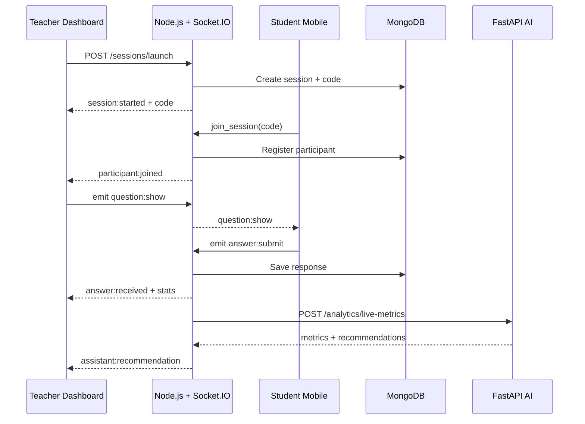

# Architecture Système — Quisi

## 1. Vue d'ensemble

Quisi est une plateforme **hybride intelligence** : les métriques pédagogiques sont calculées localement (Node.js + FastAPI analytics), puis interprétées par une API IA externe (OpenAI/Gemini) pour recommandations et rapports.

### Principes architecturaux

| Principe | Implémentation |
|----------|----------------|
| Séparation des responsabilités | Node = orchestration & temps réel ; FastAPI = analytics & IA |
| Latence < 1s | Socket.IO pour état live ; REST pour CRUD |
| Pas de ML custom | Règles locales + prompts IA structurés |
| Scalabilité | Services stateless, MongoDB Atlas, Docker |
| Sécurité | JWT, rôles teacher/student, validation entrées |

## 2. Couches applicatives

```
┌─────────────────────────────────────────────────────────────┐
│                    PRESENTATION LAYER                        │
│  React Dashboard (Teachers)  │  Expo Mobile (Students)       │
└────────────────────────────┬────────────────────────────────┘
                             │ HTTPS / WSS
┌────────────────────────────▼────────────────────────────────┐
│                    APPLICATION LAYER                         │
│  Express REST API  │  Socket.IO Hub  │  JWT Middleware       │
└────────────────────────────┬────────────────────────────────┘
                             │
        ┌────────────────────┼────────────────────┐
        ▼                    ▼                    ▼
┌───────────────┐   ┌───────────────┐   ┌───────────────────┐
│ MongoDB Atlas │   │ FastAPI AI    │   │ External AI API   │
│ Persistence   │   │ Analytics     │   │ OpenAI / Gemini   │
└───────────────┘   └───────────────┘   └───────────────────┘
```

## 3. Responsabilités par service

### Node.js Backend (`backend-node`)

| Module | Responsabilité |
|--------|----------------|
| `auth` | Register, login, JWT, refresh |
| `quizzes` | CRUD quiz & questions |
| `sessions` | Codes session, lifecycle, participants |
| `responses` | Stockage réponses, sync |
| `analytics` | Agrégation locale, proxy FastAPI |
| `reports` | Génération & stockage rapports |
| `socket` | Events live, broadcast, rooms |

### FastAPI AI Backend (`backend-ai`)

| Module | Responsabilité |
|--------|----------------|
| `analytics` | Comprehension score, engagement, trends |
| `adaptive` | Règles difficulté groupe/individuel |
| `ai_orchestrator` | Prompts, parsing réponses IA |
| `suspicion` | SuspicionScore, alertes |
| `predictive` | Dropout risk, future comprehension |
| `reports` | Synthèses, heatmaps, révisions |

## 4. Flux de données temps réel



## 5. Stratégie hybride intelligence

### Phase 1 — Analytics locales (FastAPI)

```
ComprehensionScore = 0.5×Correctness + 0.3×Participation + 0.2×ResponseSpeed
```

Métriques calculées :
- `avgResponseTime`, `successRate`, `participationRate`
- `engagementLevel` (low/medium/high)
- `dropRate`, `performanceTrend`
- `suspicionScore`

### Phase 2 — Interprétation IA

Payload structuré envoyé à l'API externe :

```json
{
  "topic": "Probability",
  "successRate": 42,
  "avgResponseTime": 18,
  "engagement": "low",
  "comprehensionScore": 52,
  "failedConcepts": ["conditional probability"]
}
```

Sorties : recommandations, résumés, ajustements difficulté, actions d'apprentissage.

## 6. Moteur adaptatif

| Condition | Action |
|-----------|--------|
| successRate > 80% | difficulty += 1 (max 5) |
| successRate < 50% | difficulty -= 1 (min 1) |
| Individual lag > 30% vs group | Question simplifiée pour cet étudiant |

## 7. Sécurité

- **JWT** : access token 7j, payload `{ userId, role, email }`
- **Rôles** : `teacher` | `student`
- **Socket.IO** : auth middleware via token handshake
- **FastAPI** : header `X-Internal-Key` pour appels Node uniquement
- **Rate limiting** : 100 req/min par IP sur routes auth
- **Helmet + CORS** : origines configurées

## 8. Déploiement Docker

| Container | Port | Image |
|-----------|------|-------|
| mongo | 27017 | mongo:7 |
| api-node | 4000 | custom |
| api-ai | 8000 | custom |
| dashboard | 5173 | custom |

Production : MongoDB Atlas externe, variables secrets via orchestrateur (Kubernetes secrets / Railway / Render).

## 9. Performance

- Socket.IO rooms par `sessionId`
- Index MongoDB sur `sessions.code`, `responses.sessionId`
- Agrégations pipeline pour stats live
- Cache mémoire session active (Map) pour latence < 1s
- FastAPI async pour appels IA parallèles

## 10. Extensibilité future

- Redis adapter Socket.IO (multi-instance)
- Queue Bull pour rapports lourds
- CDN pour assets dashboard
- WebRTC pour collaboration avancée
- SSO OAuth2 (Google Classroom)
