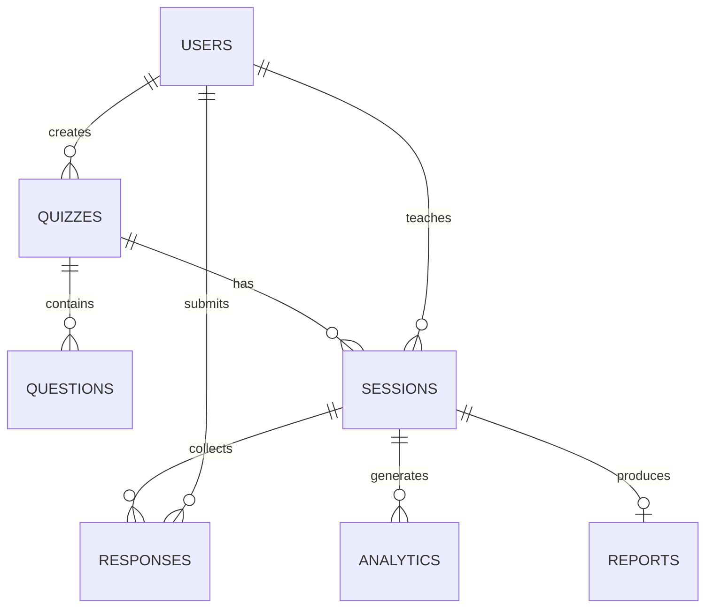

# Schéma MongoDB — Quisi

## Collections

| Collection | Description |
|------------|-------------|
| `users` | Enseignants et étudiants |
| `quizzes` | Métadonnées des quiz |
| `questions` | Questions liées aux quiz |
| `sessions` | Sessions live |
| `responses` | Réponses par participant |
| `analytics` | Snapshots métriques |
| `reports` | Rapports générés |

---

## users

```javascript
{
  _id: ObjectId,
  email: String,           // unique, indexed
  passwordHash: String,
  firstName: String,
  lastName: String,
  role: "teacher" | "student",
  avatar: String?,         // URL optionnelle
  institution: String?,
  topicsProgress: [{       // heatmap individuelle
    topic: String,
    masteryPercent: Number  // 0-100
  }],
  createdAt: Date,
  updatedAt: Date
}
```

**Index** : `{ email: 1 }` unique

---

## quizzes

```javascript
{
  _id: ObjectId,
  teacherId: ObjectId,     // ref users
  title: String,
  description: String?,
  topic: String,           // ex: "Probability"
  difficulty: Number,      // 1-5
  defaultTimerSec: Number, // secondes par question
  isPublished: Boolean,
  questionCount: Number,   // dénormalisé
  tags: [String],
  createdAt: Date,
  updatedAt: Date
}
```

**Index** : `{ teacherId: 1, createdAt: -1 }`

---

## questions

```javascript
{
  _id: ObjectId,
  quizId: ObjectId,        // ref quizzes
  order: Number,
  type: "multiple_choice" | "true_false" | "poll" | "short_answer",
  text: String,
  options: [{              // pour MC & poll
    id: String,
    label: String,
    isCorrect: Boolean?     // null pour poll
  }],
  correctAnswer: String?,  // pour short_answer / true_false
  explanation: String?,
  difficulty: Number,      // 1-5
  timerSec: Number?,
  points: Number,
  createdAt: Date
}
```

**Index** : `{ quizId: 1, order: 1 }`

---

## sessions

```javascript
{
  _id: ObjectId,
  quizId: ObjectId,
  teacherId: ObjectId,
  code: String,            // 6 chars, unique, indexed
  status: "waiting" | "active" | "paused" | "ended",
  currentQuestionIndex: Number,
  currentQuestionId: ObjectId?,
  difficultyLevel: Number, // adaptatif groupe
  participants: [{
    userId: ObjectId,
    displayName: String,
    joinedAt: Date,
    isActive: Boolean,
    individualDifficulty: Number,
    suspicionScore: Number,
    stats: {
      correct: Number,
      total: Number,
      avgResponseTimeMs: Number
    }
  }],
  settings: {
    adaptiveEnabled: Boolean,
    showLeaderboard: Boolean,
    anonymousMode: Boolean
  },
  liveMetrics: {
    responseRate: Number,
    successRate: Number,
    activeCount: Number,
    comprehensionScore: Number
  },
  startedAt: Date?,
  endedAt: Date?,
  createdAt: Date
}
```

**Index** : `{ code: 1 }` unique, `{ teacherId: 1, status: 1 }`

---

## responses

```javascript
{
  _id: ObjectId,
  sessionId: ObjectId,
  questionId: ObjectId,
  userId: ObjectId,
  answer: String,          // option id ou texte
  isCorrect: Boolean?,
  responseTimeMs: Number,
  suspicionFlags: [String], // fast_response, repetitive, etc.
  submittedAt: Date
}
```

**Index** : `{ sessionId: 1, questionId: 1, userId: 1 }` unique compound

---

## analytics

```javascript
{
  _id: ObjectId,
  sessionId: ObjectId?,
  userId: ObjectId?,       // null = session-level
  quizId: ObjectId?,
  type: "live" | "session_end" | "predictive" | "heatmap",
  metrics: {
    comprehensionScore: Number,
    successRate: Number,
    avgResponseTime: Number,
    participationRate: Number,
    engagement: "low" | "medium" | "high",
    dropRate: Number,
    performanceTrend: "improving" | "stable" | "declining",
    suspicionScore: Number?,
    dropoutRisk: Number?,
    topicMastery: [{ topic: String, percent: Number }]
  },
  aiInsights: {
    summary: String?,
    recommendations: [String],
    misunderstoodConcepts: [String],
    difficultySuggestion: String?
  },
  calculatedAt: Date
}
```

**Index** : `{ sessionId: 1, type: 1, calculatedAt: -1 }`

---

## reports

```javascript
{
  _id: ObjectId,
  sessionId: ObjectId,
  teacherId: ObjectId,
  title: String,
  summary: String,
  weakConcepts: [String],
  recommendations: [String],
  engagementChart: [{ timestamp: Date, value: Number }],
  heatmap: [{ topic: String, masteryPercent: Number }],
  revisionPlan: [{
    day: Number,
    title: String,
    activities: [String]
  }],
  generatedAt: Date
}
```

---

## Relations

```
users (teacher) ──1:N──> quizzes
quizzes ──1:N──> questions
quizzes ──1:N──> sessions
sessions ──1:N──> responses
sessions ──1:N──> analytics
sessions ──1:1──> reports (fin de session)
users (student) ──1:N──> responses
```

## Diagramme entité-relation


