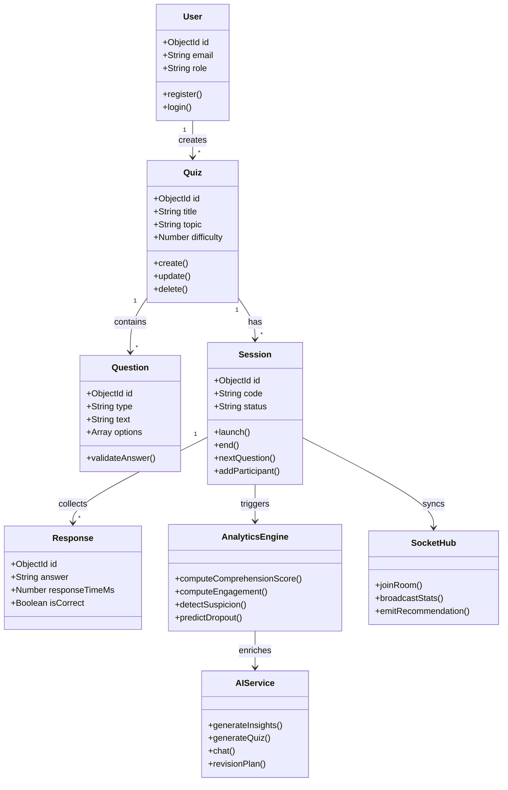
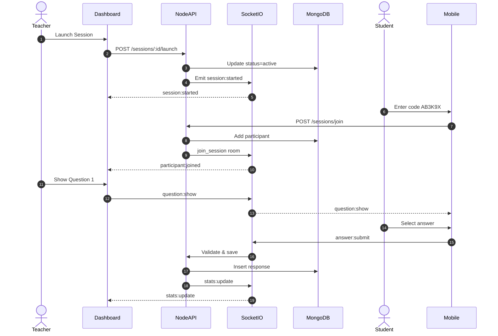
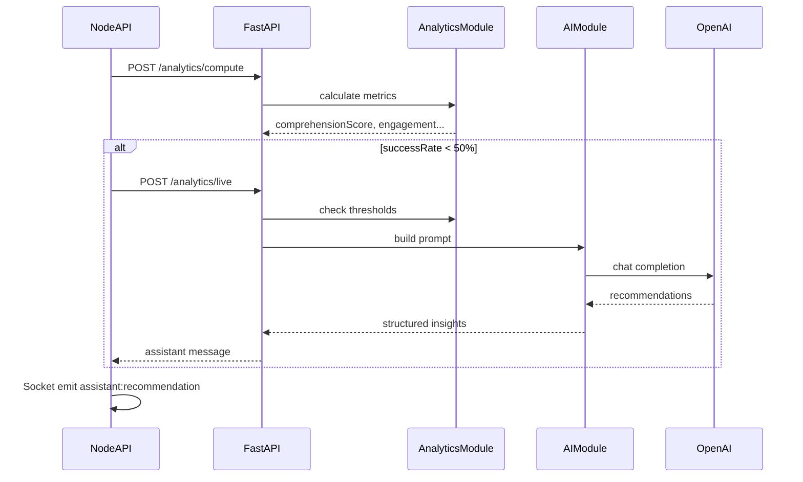
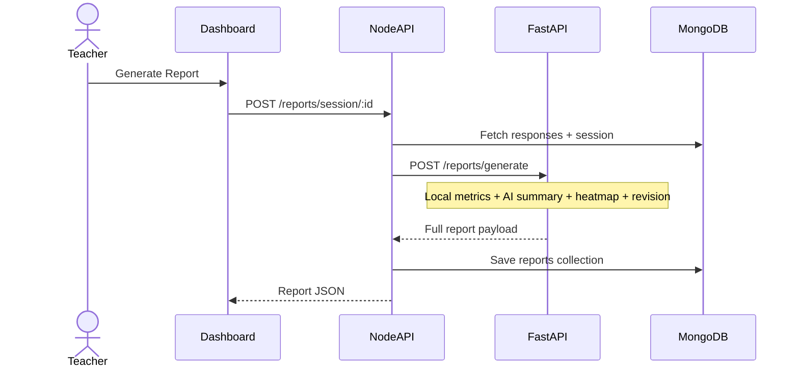
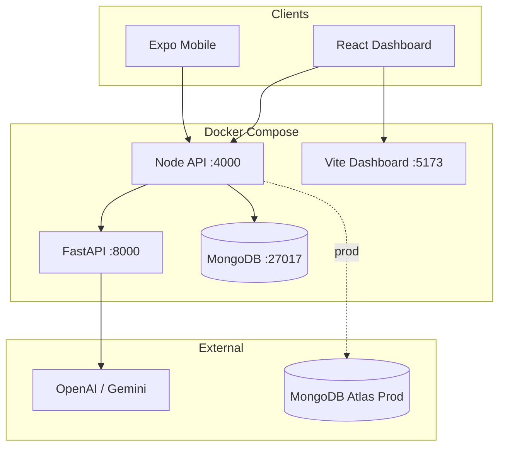
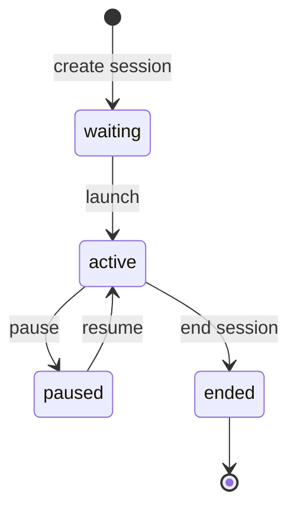
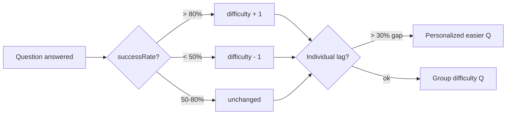

# Diagrammes — Quisi

## Diagramme de classes (simplifié)

---

## Séquence : Lancement session & première question

---

## Séquence : Pipeline Analytics + IA

---

## Séquence : Génération rapport

---

## Diagramme composants déploiement

---

## État session (machine à états)

---

## Flux adaptatif difficulté

